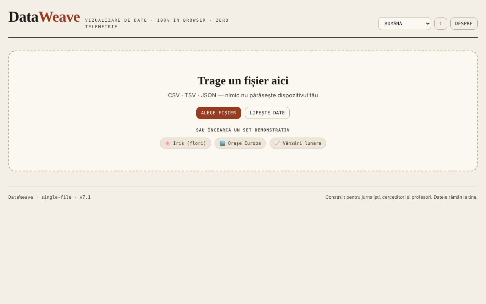

# DataWeave

Atelier de vizualizare și analiză a datelor tabelare, direct în browser.

**Live:** https://chiuta.github.io/DataWeave/

## Ce este

DataWeave este o aplicație HTML dintr-un singur fișier pentru explorarea fișierelor CSV, TSV și JSON: tabel, statistici, grafice, tabel pivot și corelații. Este gândită, după cum spune aplicația, pentru jurnaliști, cercetători și profesori; datele rămân pe dispozitivul tău.

## Funcții

- Încărcare prin tragere de fișier, „Alege fișier" sau „Lipește date" (CSV, TSV, JSON); trei seturi demonstrative: Iris (flori), Orașe Europa, Vânzări lunare.
- Filele Tabel (sortare prin click pe antet), Statistici, Grafice, Pivot, Corelații.
- Filtre multiple („+ Adaugă", „Șterge tot").
- Unelte de date: elimină duplicate, curăță spații, coloană calculată, reordonare și ascundere coloane.
- Grafice: bare, linie, scatter, histogramă, box-plot, heatmap, plăcintă; agregări (sumă, medie, mediană, număr, min, max, deviație standard), culoare după coloană, Top-N, orizontal, etichete de valori, stivuit.
- Regresie (liniară, logaritmică, exponențială, putere, polinomială grad 2 și 3), intervale de încredere și de predicție (90/95/99%), curbă normală, medie/mediană, medie mobilă.
- Pivot cu rânduri, coloane opționale, valoare și agregare; export CSV.
- Corelații Pearson sau Spearman, cu export SVG/PNG.
- „Salvează sesiune" / „Încarcă sesiune"; export statistici, JSON, CSV; grafice ca SVG sau PNG.
- Temă luminoasă/întunecată (butonul ☾) și interfață în 7 limbi: English, Română, Français, Italiano, Español, Português, Deutsch.

## Manual de utilizare

1. Alege limba din meniul de limbă.
2. În „Date noi" trage un fișier CSV/TSV/JSON, apasă „Alege fișier" sau „Lipește date" (apoi „Încarcă"); alternativ, alege un set demonstrativ.
3. În fila Tabel sortezi cu click pe antet; „+ Adaugă" la Filtre adaugă o condiție (Enter confirmă).
4. În „Unelte date" poți elimina duplicate, curăța spații, crea o „+ Coloană calculată" sau reordona/ascunde coloane.
5. În Grafice alegi tipul, axele X și Y și agregarea, apoi opțional regresia sau intervalele; descarcă cu „⬇ SVG" / „⬇ PNG".
6. În Pivot alegi rânduri, coloane, valoare și agregare, apoi „Export CSV".
7. În Corelații alegi metoda (Pearson sau Spearman).
8. „Salvează sesiune" păstrează lucrul într-un fișier, pe care îl reiei cu „Încarcă sesiune".
9. Esc închide panourile deschise (formular de coloană, zona de lipire, fereastra „Despre").

## Confidențialitate și rețea

- Aplicația nu folosește `localStorage`, `sessionStorage` sau IndexedDB și nu face cereri de rețea (fără `fetch`, CDN sau scripturi externe). Datele încărcate sunt prelucrate în memorie și dispar la reîncărcare, în afară de ce salvezi tu prin exporturi.
- Conține doar link-uri, deschise la click, către Patreon, Buy Me a Coffee și chiuta.github.io.

## Rulare locală / offline

Descarcă `index.html` și deschide-l în browser; nu are nevoie de internet.

## Licență

CC0 1.0 Universal (domeniu public) — vezi fișierul LICENSE

## Autor

Alexio — Alexandru-Ionuț Chiuță, contact: alexio@trom.tf

## English summary

DataWeave is a single-file HTML workshop for exploring CSV, TSV and JSON data: table, statistics, charts (bar, line, scatter, histogram, box-plot, heatmap, pie, with regression and confidence intervals), pivot and correlations. Sessions and results can be exported. 7 UI languages. It stores nothing in the browser and makes no network requests.
